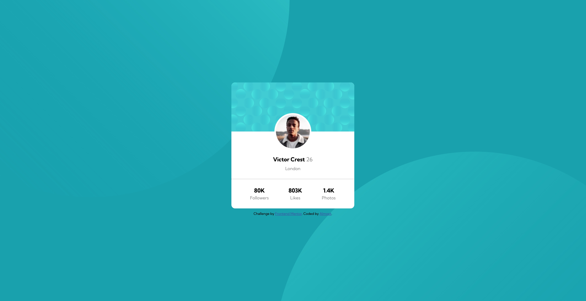

# Frontend Mentor - Profile card component solution

This is a solution to the [Profile card component challenge on Frontend Mentor](https://www.frontendmentor.io/challenges/profile-card-component-cfArpWshJ). Frontend Mentor challenges help you improve your coding skills by building realistic projects. 

## Table of contents

- [Overview](#overview)
  - [The challenge](#the-challenge)
  - [Screenshot](#screenshot)
  - [Links](#links)
- [My process](#my-process)
  - [Built with](#built-with)
  - [What I learned](#what-i-learned)
  - [Useful resources](#useful-resources)
- [Author](#author)

**Note: Delete this note and update the table of contents based on what sections you keep.**

## Overview

### The challenge

- Build out the project to the designs provided

### Screenshot



### Links

- Solution URL: [Add solution URL here](https://your-solution-url.com)
- Live Site URL: [Add live site URL here](https://your-live-site-url.com)

## My process

Mainly used this project to pratice some CSS properties, such as Position and Display.

### Built with

- Semantic HTML5 markup
- CSS custom properties

### What I learned

Manage to display the two background circles behind of the card with help of CSS propertie Positin: Absolut.

```css
.left-circle img{
    position: absolute;
    top: -650px;
    left: -350px;
    opacity: 0.8;
    z-index: -1;
    width: 1300px;
}

.right-circle img{
    position: absolute;
    top: 500px;
    left: 900px;
    opacity: 0.8;
    z-index: -1;
    width: 1300px;
}
```

I also learned how to resize svg's and how to use them. Used the  tag to embed the svg in order to be capable of resize it.

```html
<div class="left-circle">
  
</div>

<div class="right-circle">
  
</div> 
```

```css
.left-circle img{
    position: absolute;
    top: -650px;
    left: -350px;
    opacity: 0.8;
    z-index: -1;
    width: 1300px;
}
```

Learned how to use an image as a background for profile picture purpose combined with the properties display: absolute to place it where I wanted.

```html
<div class="avatar-profile"></div>
```

```css
.avatar-profile {
    width: 110px;
    height: 110px;
    border-radius: 50%;
    background: white;
    border: 5px solid white;
    background-image: url(./images/image-victor.jpg);
    background-size: cover;
    position: absolute;
    left: 0;
    right: 0;
    margin: 0 auto;
    top: 100px;
}
```

Learned propertly how the Propertie Display (inline, block and inline-block) works. Used it to place the profile and social media info in the right place.
```html
<div class="profile-info">

  <div class="basic-info">
    <span class="bold"> Victor Crest</span>
    <span class="grey-special">26</span>
    <p class="grey">London</p>
  </div>  

</div>

<hr>

<div class="profile-social-media">

  <div class="social-media">
    <span class="bold block">80K</span>
    <span class="grey">Followers</span>
  </div>

  <div class="social-media">
    <span class="bold block">803K</span>
    <span class="grey">Likes</span>
  </div>

  <div class="social-media">
    <span class="bold block">1.4K</span>
    <span class="grey">Photos</span>
  </div>

</div>
```

```css
.profile-social-media{
    text-align: center;
    padding: 0 0 25px;
}

.social-media {
    display: inline-block;
    margin: 0px 30px;
} 

.block {
    display: block;
}
```

### Useful resources

- [How to Scale SVG](https://css-tricks.com/scale-svg/) - This helped understand how to resize a svg and how svg's work.

## Author

- Website - [Alexandre Morgado](https://github.com/Almopt)
- Frontend Mentor - [@Almopt](https://www.frontendmentor.io/profile/Almopt)
- Twitter - [@Almo_pt](https://www.twitter.com/Almo_pt)
